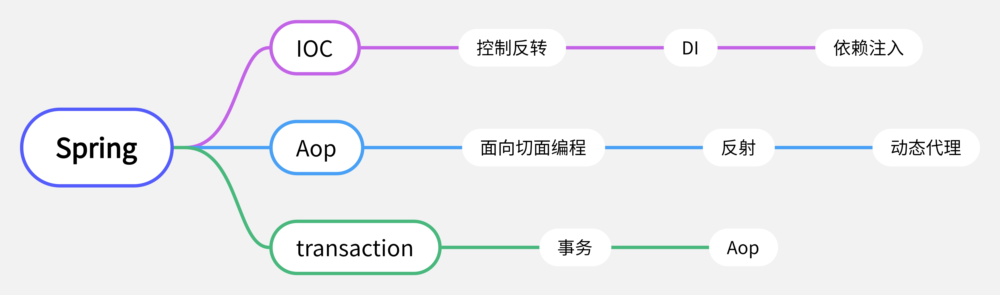

#纯配置文件配置spring
1.思维导图

2. 要看着导图能把spring给将完 这不是最基本的么
3. 创建spring项目需要导入哪些基础的jar包这些可以不记住,但是要能找到
4. 创建spring配置文件,以及理解为什么要这样配置
5. 想啥呢开始搞,总不能一直做一个菜鸟吧
6. 这里想用idea中的Terminal面板去执行mvn命令发现了一些问题,因为之前电脑系统重置过导致jdk跟maven的环境变量都被删除了需要重新将环境变量配置好 然后重启idea就可以了
7. 在使用mysql的过程中出现了一个问题,执行sql的时候提醒我要配置ssl连接(这个原因是因为mysql的版本跟connector的版本不一致导致的所以我升级了connector包的版本注意要修改mybatis配置中的驱动还有连接),但是在使用sqlSession执行sql语句的时候插入成功了但是数据库中没有显示(sqlsession的事务默认是手动提交的没有提交肯定是找不到的)
8. 在配置好mybatis之后经过测试mybatis跟mysql已经配置为可用这时候就该想到怎样将mybatis跟spring结合起来去使用了
9. 在配置好事务后去测试的时候出现了一个问题在serviceImpl的一个方法中做了添加people跟删除people的操作想要做成原子性操作,但是测试的时候一直没有达到自己想要的效果,结果发现事务配置的范围没有配置到service层的方法中谨记不要犯同样的错误